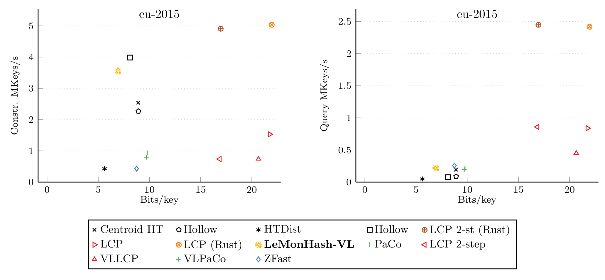
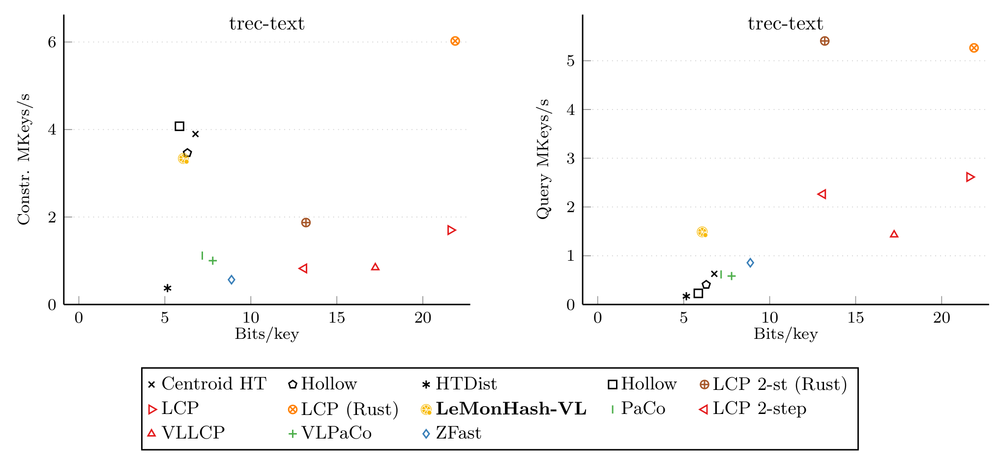
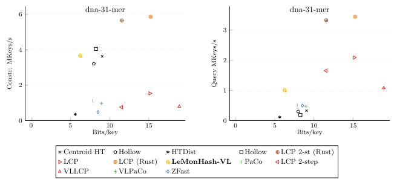
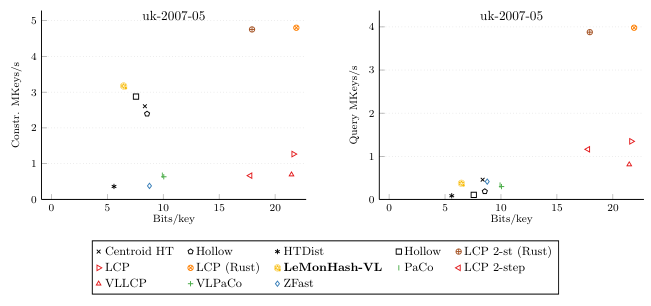
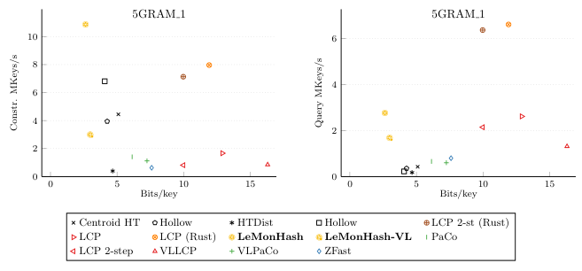
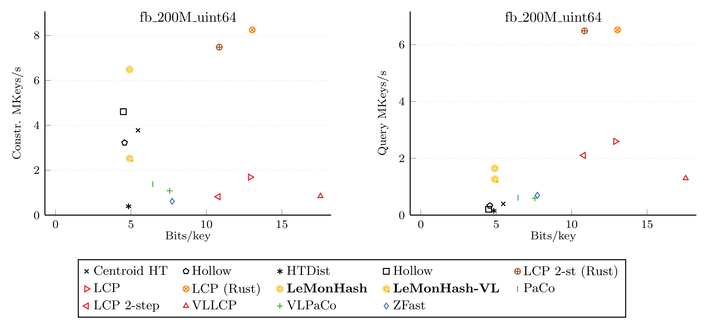
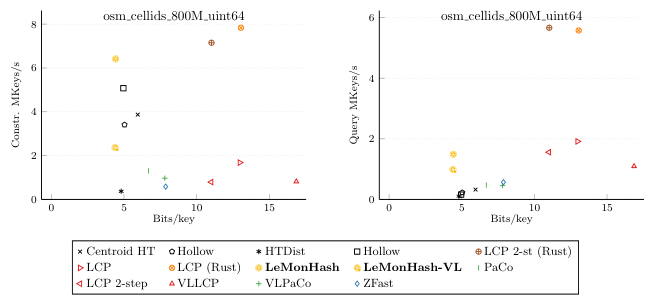
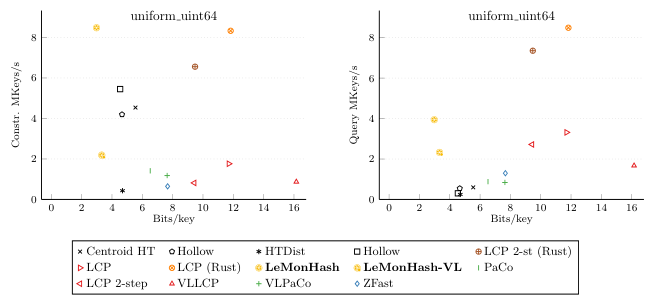
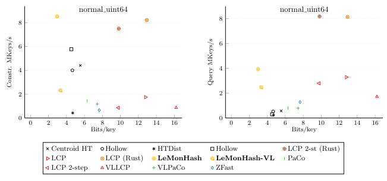
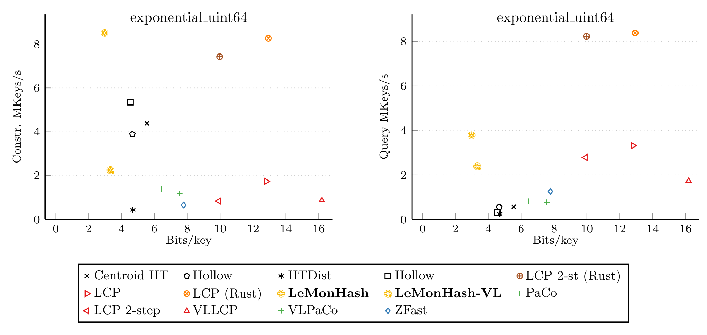

# LeMonHash and Monotone Minimal Perfect Hash Functions, Revisited

This repository is a fork of the [original MMPHF-Experiments
repository](https://github.com/ByteHamster/MMPHF-Experiments) for the paper
“[Learned Monotone Minimal Perfect
Hashing](https://drops.dagstuhl.de/entities/document/10.4230/LIPIcs.ESA.2023.46)”.
It contains updated code, including Rust implementation of the LCP-based
functions and a fix to the Java experiments. If you're looking for advice on the
choice of a MMPHF, the results in the paper are somewhat misleading for three
main reasons:

- An “apples-and-oranges” problem: the experiments tested an implementation of
  LeMonHash hardwired for integer or sequences of bytes against Java code designed
  to turn any object into a bit vector via a runtime-specified transformation
  strategy, and then process it. This level of genericity has a high cost not
  shared by the C++ implementations.

- C++ vs. Java for these data structures implies at least a 2x slowdown.

- Through an oversight, the authors used a UTF-16 transformation strategy that
  doubled the length of all ASCII strings passed to the Java data structures,
  squaring the size of the underlying universe. For a 10-byte key passed to
  C++ structures, Java would get a 20-byte key. This impacted both the size and
  the speed of the Java implementations as they had to manage twice the data.

Here we try to give a more balanced set of results:

- The LCP-based MMPHFs are now available in the Rust
  [`sux`](https://crates.io/crates/sux) crate, providing, at least for those
  types of MMPHF, a way out of the “apples-and-oranges” problem.

- We modified the test so that the Java code would use the cheapest available
  transformation strategy, which simply maps the input to byte arrays. This is
  the same setup used in the paper “[Theory and Practice of Monotone Minimal Perfect
  Hashing](https://doi.org/10.1145/1963190.2025378)” that introduced them.

- From the results of the paper, a scaling problem was already rather evident at
  larger key sizes. We added a test on [1B
  URLs](https://law.di.unimi.it/webdata/eu-2015/) showing clear nonconstant
  behavior: at 100M URLs LeMonHash is 4× slower than an LCP-based MMPHF; at 1B
  URLs, 11× slower.

The picture one gets from the new experiments is that LeMonHash is probably the
best contender in the “high-compression, slow queries” corner of the design
space. It certainly is for integer keys. If speed is essential, however,
LCP-based solutions use more space but are an order of magnitude faster, and the
gap is likely to widen on larger datasets. Given the indexing nature of these
structures (they usually map to some other ancillary data), the extra
compression rarely justifies the slowdown, but this must be checked on a
case-by-case basis.

In retrospect, the framework of “[Theory and Practice of Monotone Minimal
Perfect Hashing](https://doi.org/10.1145/1963190.2025378)” flattened real speed
differences between structures. Full genericity was necessary to implement all of
them in a reasonable time, but it obscured constant factors that matter at
scale.

